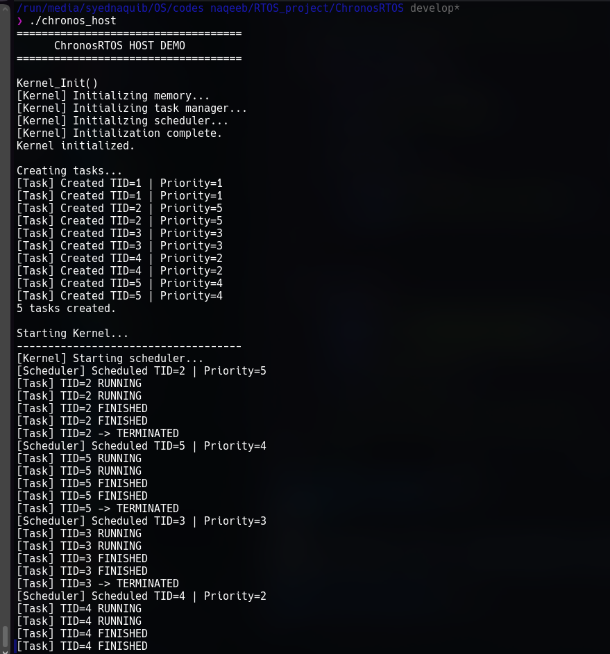

# ChronosRTOS

A small educational real-time operating system developed for the STM32F103C8T6 (ARM Cortex-M3). The project focuses on understanding the internal structure of an RTOS by implementing the kernel, task management, scheduler, static memory management, dispatcher, debugging interface, and ARM Cortex-M3 porting layer from the ground up.

---

## 1. Project Overview

ChronosRTOS is a lightweight RTOS prototype designed for the STM32F103C8T6, commonly known as the Blue Pill.

The project is intended primarily as an educational implementation rather than a production-ready RTOS. The main objective is to understand how the different components of an operating system interact at the microcontroller level.

The current implementation includes:

* Kernel initialization and startup
* Static task management
* Task Control Blocks (TCBs)
* Fixed-size task stacks
* Priority-based scheduling
* Cooperative task execution
* Task creation
* Task termination
* Task suspension and resumption
* Idle task
* Task dispatcher
* Diagnostic/debug output
* Host-side testing
* STM32 hardware build
* Initial ARM Cortex-M3 port structure

The project is being developed incrementally, with the current prototype concentrating on the kernel/task/scheduler path before completing hardware context switching.

---

# 2. Target Hardware

**Microcontroller**

* STM32F103C8T6
* ARM Cortex-M3
* 32-bit processor
* Maximum clock frequency: 72 MHz

**Development board**

* STM32F103C8T6 Blue Pill

**Current hardware configuration**

* HSE: 8 MHz
* PLL: ×9
* SYSCLK: 72 MHz
* APB1: 36 MHz
* APB2: 72 MHz
* USART1 configured for asynchronous communication
* PC13 configured as GPIO output

---

# 3. Project Structure

```text
ChronosRTOS/
│
├── Core/
│   ├── Inc/
│   │   ├── config.h
│   │   ├── error.h
│   │   ├── kernel.h
│   │   ├── memory.h
│   │   ├── scheduler.h
│   │   ├── task.h
│   │   └── types.h
│   │
│   └── Src/
│       ├── idle.c
│       ├── kernel.c
│       ├── memory.c
│       ├── scheduler.c
│       ├── task.c
│       └── dispatcher.c
│
├── Port/
│   └── ARM_CM3/
│       ├── Inc/
│       │   ├── critical.h
│       │   ├── port.h
│       │   └── systick.h
│       │
│       ├── Src/
│       │   ├── critical.c
│       │   ├── port.c
│       │   └── systick.c
│       │
│       └── ASM/
│           ├── atomic.s
│           ├── context.s
│           ├── faults.s
│           ├── pendsv.s
│           ├── startup.s
│           ├── vectors.s
│           └── svc.s
│
├── Drivers/
│   ├── Inc/
│   │   ├── gpio.h
│   │   └── uart.h
│   │
│   └── Src/
│       ├── gpio.c
│       └── uart.c
│
├── Demo/
│   ├── demo_tasks.c
│   └── demo_tasks.h
│
├── Tests/
│   ├── Host/
│   │   └── main.c
│   └── .gitkeep
│
├── Docs/
│   ├── API.md
│   ├── Architecture.md
│   └── DevelopmentPlan.md
│
├── ChronosRTOS_HW/
│   ├── Core/
│   ├── Drivers/
│   ├── Makefile
│   └── ...
│
├── README.md
├── LICENSE
└── .gitignore
```

---

# 4. Core Components

## 4.1 Kernel

The kernel provides the top-level control flow of ChronosRTOS.

Main responsibilities:

1. Initialize memory management
2. Initialize task management
3. Initialize the scheduler
4. Start the scheduler
5. Dispatch selected tasks
6. Terminate tasks after cooperative execution

The main initialization sequence is:

```text
Kernel_Init()
     |
     +-- Mem_Init()
     |
     +-- Task_Init()
     |
     +-- Scheduler_Init()
```

Execution starts with:

```text
Kernel_Start()
```

---

# 5. Task Management

Task management is implemented in:

```text
Core/Src/task.c
Core/Inc/task.h
```

Each task is represented by a Task Control Block.

The current TCB contains:

```c
typedef struct TCB {
    uint32_t tid;
    uint32_t pc;
    TaskState task_state;
    uint8_t task_priority;
    uint32_t *sp;
    uint32_t cpu_ticks;
    uint32_t run_count;
    TaskFunction task_function;

    struct TCB *next;
} TCB;
```

## TCB fields

| Field             | Purpose                          |
| ----------------- | -------------------------------- |
| `tid`           | Unique task identifier           |
| `pc`            | Program counter information      |
| `task_state`    | Current task state               |
| `task_priority` | Scheduling priority              |
| `sp`            | Saved stack pointer              |
| `cpu_ticks`     | CPU execution tick counter       |
| `run_count`     | Number of scheduling occurrences |
| `task_function` | Function executed by the task    |
| `next`          | Link to the next TCB             |

---

# 6. Task States

ChronosRTOS defines:

```text
TASK_NEW
TASK_READY
TASK_RUNNING
TASK_BLOCKED
TASK_TERMINATED
```

The intended lifecycle is:

```text
             +---------+
             |   NEW   |
             +----+----+
                  |
                  v
             +---------+
             |  READY  |
             +----+----+
                  |
                  v
             +---------+
             | RUNNING |
             +----+----+
                  |
          +-------+-------+
          |               |
          v               v
      BLOCKED         TERMINATED
          |
          |
          v
        READY
```

The current cooperative prototype does not yet perform a hardware context switch between these states.

---

# 7. Task Creation

Tasks are created using:

```c
Task_Create(TaskFunction task_function, uint8_t priority);
```

Example:

```c
Task_Create(TASK_A, 1);
Task_Create(TASK_B, 5);
Task_Create(TASK_C, 3);
```

The system currently supports:

```c
#define MAX_TASKS 6
```

One slot is reserved for the Idle task.

Therefore:

```text
TCB0 = Idle
TCB1-TCB5 = user task slots
```

There can currently be up to **five user tasks**.

---

# 8. Task Stack Management

Each task receives a statically allocated stack.

Current configuration:

```c
#define TASK_STACK_SIZE_WORDS 256
```

Since one word is 4 bytes:

```text
256 × 4 = 1024 bytes
```

Each task therefore receives:

```text
1 KB
```

of stack storage.

The stack storage is maintained in `memory.c`:

```c
static uint32_t task_stacks[MAX_TASKS][TASK_STACK_SIZE_WORDS];
```

The task ID is also used as the stack-slot identifier.

For example:

```text
TID 5 → stack slot 5
TID 4 → stack slot 4
TID 3 → stack slot 3
...
```

---

# 9. Static Memory Allocation

ChronosRTOS currently uses static allocation.

There is no dynamic heap allocation for task creation.

The free task slots are maintained using a small stack-based free-slot manager inside `task.c`.

During initialization:

```text
Free slots:

5
4
3
2
1
```

The first created user task therefore receives slot 5.

The current allocation sequence is:

```text
Task A → TID 5
Task B → TID 4
Task C → TID 3
Task D → TID 2
Task E → TID 1
Idle   → TID 0
```

The task IDs should be treated as implementation-generated identifiers rather than fixed IDs assigned by the application.

---

# 10. Scheduler

The scheduler is implemented in:

```text
Core/Src/scheduler.c
```

ChronosRTOS currently uses a **priority-based scheduler**.

The scheduler searches the runnable circular task list and selects the task with the highest priority.

Current priority convention:

```text
Higher number = higher priority
```

The Idle task has priority:

```text
0
```

Example:

```text
Task A → priority 1
Task B → priority 5
Task C → priority 3
Task D → priority 2
Task E → priority 4
Idle   → priority 0
```

The scheduler therefore selects according to priority:

```text
5 → 4 → 3 → 2 → 1 → 0
```

The scheduler interface includes:

```c
void Scheduler_Init(void);

TCB *Scheduler_Select_Next(void);

void Scheduler_Set_Current(TCB *task);
```

---

# 11. Cooperative Execution

The current prototype is **cooperative**, not preemptive.

A task executes until its task function returns.

The basic execution model is:

```text
Kernel_Start()
      |
      v
Scheduler_Select_Next()
      |
      v
Select highest-priority task
      |
      v
Dispatcher_Run()
      |
      v
Execute task function
      |
      v
Task function returns
      |
      v
Task_Terminate()
      |
      v
Select next task
```

For example:

```text
Task B
priority = 5
       |
       v
execute B()
       |
       v
B returns
       |
       v
B terminated
       |
       v
scheduler selects next task
```

This is intentionally different from a preemptive RTOS where a timer interrupt can interrupt a running task.

---

# 12. Dispatcher

The dispatcher is implemented in:

```text
Core/Src/dispatcher.c
```

The dispatcher is responsible for invoking the selected task's function.

Conceptually:

```text
Scheduler
    |
    | selected TCB
    v
Dispatcher
    |
    | task_function()
    v
Task executes
```

The dispatcher also produces diagnostic messages around task execution.

The current dispatcher does not perform the low-level CPU context switch.

---

# 13. Task Termination

In the current cooperative design, the kernel handles termination after the dispatched task returns.

The sequence is:

```text
Dispatcher_Run(task)
       |
       v
task->task_function()
       |
       v
function returns
       |
       v
Kernel_Start()
       |
       v
Task_Terminate(task)
```

When a task terminates:

* It is removed from the runnable circular list.
* Its state becomes `TASK_TERMINATED`.
* Its task slot is returned to the free-slot stack.
* `task_count` is decremented.
* The current task pointer is moved to the next runnable task.

---

# 14. Task Suspension

A task can be suspended using:

```c
Task_Suspend(TCB *task);
```

A suspended task changes to:

```text
TASK_BLOCKED
```

and is removed from the runnable list.

The task's slot remains allocated.

Therefore:

```text
Suspend ≠ Terminate
```

A suspended task can later be returned to the runnable list using:

```c
Task_Resume(TCB *task);
```

which changes its state back to:

```text
TASK_READY
```

---

# 15. Idle Task

TCB0 is reserved for the Idle task.

Its priority is:

```text
0
```

The Idle task remains available after all user tasks have terminated.

The embedded system therefore does not simply stop when there are no user tasks.

Instead:

```text
All user tasks terminated
        |
        v
Idle task remains
        |
        v
Kernel continues running
```

The host test environment uses a limited Idle execution count so that the test program can eventually return to the shell.

This host-only behavior does not represent the intended embedded behavior.

---

# 16. Debug System

Diagnostic output is implemented through:

```text
Core/Src/debug.c
Core/Inc/debug.h
```

The debug interface provides messages for:

* Task creation
* Scheduling
* Task execution
* Task completion
* Task termination
* Blocking
* Resuming
* Invalid operations
* Scheduler failures

Example:

```text
[Task] Created TID=4 | Priority=5
[Scheduler] Scheduled TID=4 | Priority=5
[Task] TID=4 RUNNING
[Task] TID=4 FINISHED
[Task] TID=4 -> TERMINATED
```

---

# 17. Host Debugging

ChronosRTOS contains a host-specific debugging path controlled by:

```c
CHRONOS_HOST
```

When compiling the host test:

```bash
-DCHRONOS_HOST
```

the debug system uses standard C output:

```c
printf()
```

The STM32 build instead uses the UART driver.

This allows the same RTOS debugging API to be used in both environments.

---

# 18. Host Testing

The host test is located at:

```text
Tests/Host/main.c
```

The purpose of the host test is to test the RTOS logic without requiring the STM32 hardware.

The host test uses the actual ChronosRTOS implementations of:

```text
task.c
memory.c
scheduler.c
kernel.c
dispatcher.c
debug.c
```

Only hardware-dependent pieces that cannot execute on the host are replaced.

The host test provides its own:

```c
Idle_Function()
```

so that the embedded `idle.c` does not need to be linked into the host executable.

---

# 19. Building the Host Test

From the root of the ChronosRTOS repository:

```bash
gcc -DCHRONOS_HOST \
    -ICore/Inc \
    -IPort/ARM_CM3/Inc \
    -IDrivers/Inc \
    Tests/Host/main.c \
    Core/Src/task.c \
    Core/Src/memory.c \
    Core/Src/scheduler.c \
    Core/Src/kernel.c \
    Core/Src/dispatcher.c \
    Core/Src/debug.c \
    -o chronos_host
```

Run:

```bash
./chronos_host
```

The host build intentionally does not include:

```text
Core/Src/idle.c
```

because the host test provides its own `Idle_Function()`.

---

# 20. Host Pointer-Cast Warning

When compiling `task.c` for a 64-bit host, GCC may report:

```text
warning: cast from pointer to integer of different size
```

for code such as:

```c
*sp = (uint32_t)task_function;
```

and:

```c
*sp = (uint32_t)Task_Exit_Handler;
```

This occurs because:

```text
Host pointer = 64 bits
uint32_t     = 32 bits
```

The stack-frame construction is intended for the 32-bit Cortex-M3 target.

The current host dispatcher does not use this constructed ARM stack frame for execution. Therefore these warnings are expected during the host build and are not evidence of an ARM build failure.





---

# 21. STM32 Hardware Build

The hardware project is located in:

```text
ChronosRTOS_HW/
```

The project uses the ARM GNU toolchain.

Required tools include:

* `arm-none-eabi-gcc`
* `make`
* STM32 development files included in the project

Build:

```bash
cd ChronosRTOS_HW
make clean
make
```

A successful build produces:

```text
build/ChronosRTOS.elf
build/ChronosRTOS.hex
build/ChronosRTOS.bin
```

The ELF file is used for debugging.

The HEX and BIN files can be used by suitable STM32 flashing tools.

---

# 22. Current Hardware Build Status

The current STM32 project has successfully completed compilation and linking.

The generated firmware size is currently:

```text
text    data    bss     dec     hex
6112    12      7948    14072   36f8
```

The successful build confirms that the current ChronosRTOS source integrates with the STM32 hardware project and produces a Cortex-M3 firmware image.

A successful build does not by itself confirm runtime behavior on the physical MCU.

---

# 23. CubeMX Hardware Project

The STM32 hardware environment was generated/configured using STM32CubeMX.

CubeMX is used for the hardware initialization layer, including:

* MCU selection
* Clock configuration
* GPIO configuration
* USART configuration
* HAL initialization
* Startup configuration

ChronosRTOS sits above this hardware initialization layer.

The general relationship is:

```text
STM32 hardware
       |
       v
CubeMX / HAL initialization
       |
       v
ChronosRTOS
       |
       +-- Kernel
       +-- Task Manager
       +-- Scheduler
       +-- Dispatcher
       +-- Memory
       |
       v
Application Tasks
```

CubeMX does not represent a separate RTOS that must be flashed before ChronosRTOS. The generated hardware initialization and ChronosRTOS are linked together into the same firmware image.

---

# 24. ARM Cortex-M3 Port

The project contains an ARM Cortex-M3 port under:

```text
Port/ARM_CM3/
```

The port is intended to provide the processor-specific functionality required by the RTOS.

The directory contains:

```text
Inc/
    critical.h
    port.h
    systick.h

Src/
    critical.c
    port.c
    systick.c

ASM/
    atomic.s
    context.s
    faults.s
    pendsv.s
    startup.s
    vectors.s
    svc.s
```

The low-level context-switching implementation is part of the later development stage.

---

# 25. SysTick

SysTick is intended to provide the periodic system tick required by an RTOS.

The current design separates:

```text
systick_init()
```

from:

```text
systick_handler()
```

The interrupt handler is not intended to contain the complete context-switch implementation.

The eventual flow is expected to involve:

```text
SysTick interrupt
       |
       v
system tick handling
       |
       v
scheduler/timing decision
       |
       v
PendSV/context switch
```

The complete preemptive context-switch path is not yet the focus of the current prototype.

---

# 26. Context Switching

The project contains the planned ARM assembly files for low-level context switching:

```text
context.s
pendsv.s
svc.s
```

These files are intended to handle processor-specific register saving/restoring and exception-based switching.

The current kernel prototype does **not** depend on a completed hardware context switch for its cooperative execution model.

Therefore the current demonstration can proceed through:

```text
Scheduler
    ↓
Dispatcher
    ↓
Task function
    ↓
Return
    ↓
Termination
```

before the final context-switch implementation is integrated.

---

# 27. Current Execution Model

The current prototype can be summarized as:

```text
                    Kernel_Init()
                         |
          +--------------+--------------+
          |              |              |
       Memory          Task         Scheduler
       Init            Init            Init
          |              |              |
          +--------------+--------------+
                         |
                         v
                    Kernel_Start()
                         |
                         v
                 Select Next Task
                         |
                         v
                    Dispatcher
                         |
                         v
                  Execute Task
                         |
                         v
                    Task Returns
                         |
                         v
                   Terminate Task
                         |
                         v
                 Select Next Task
                         |
                         v
                       Idle
```

---

# 28. Example Application

A typical application creates several tasks with different priorities:

```c
Task_Create(TASK_A, 1);
Task_Create(TASK_B, 5);
Task_Create(TASK_C, 3);
Task_Create(TASK_D, 2);
Task_Create(TASK_E, 4);
```

The scheduler uses the priorities to determine which task should execute next.

The task functions themselves remain simple application-level functions.

For example:

```c
void TASK_A(void)
{
    /* Application work */
}
```

The RTOS is responsible for managing the task rather than embedding scheduler logic inside every application task.

---

# 29. Design Decisions

The current prototype intentionally uses:

### Static allocation

No dynamic task-memory allocation is required.

### Fixed task limits

```text
6 total TCB slots
5 user tasks
1 Idle task
```

### Fixed stack size

```text
1024 bytes per task
```

### Priority-based scheduling

Higher numerical priority is selected first.

### Cooperative execution

A task runs until its function returns.

### Circular task list

Runnable tasks are maintained as a circular singly linked list.

### Dedicated Idle task

Idle occupies TCB0 and priority 0.

---

# 30. Development Status

Current implementation status:

| Component                      | Status              |
| ------------------------------ | ------------------- |
| Project structure              | Complete            |
| Static memory pool             | Implemented         |
| TCB management                 | Implemented         |
| Task creation                  | Implemented         |
| Task termination               | Implemented         |
| Task suspension                | Implemented         |
| Task resume                    | Implemented         |
| Idle task                      | Implemented         |
| Priority scheduler             | Implemented         |
| Cooperative dispatcher         | Implemented         |
| Debug interface                | Implemented         |
| Host test infrastructure       | In progress/testing |
| STM32 build                    | Successful          |
| SysTick structure              | Present             |
| ARM port structure             | Present             |
| Hardware context switching     | Not yet completed   |
| Physical hardware runtime test | Pending             |

---

# 31. Development Philosophy

ChronosRTOS is being developed incrementally.

The implementation is divided into several conceptual layers:

```text
Application
    |
    v
Kernel
    |
    +---- Task Management
    |
    +---- Scheduler
    |
    +---- Dispatcher
    |
    +---- Memory Management
    |
    v
Processor Port
    |
    v
ARM Cortex-M3
```

This separation allows the task-management and scheduling logic to be tested independently from the processor-specific context-switching implementation.

---

# 32. Limitations of the Current Prototype

The current implementation should not be considered a production RTOS.

Current limitations include:

* Cooperative rather than fully preemptive execution
* Hardware context switching is not yet complete
* Task timing statistics are not yet fully implemented
* `pc`, `cpu_ticks`, and `run_count` are currently part of the TCB but are not fully maintained
* Host execution does not reproduce ARM hardware behavior
* Host pointer-size warnings may occur during ARM stack-frame construction
* Physical STM32 runtime testing is still required
* Synchronization primitives are not yet implemented
* Inter-task communication is not yet implemented
* Dynamic memory management is not implemented
* Full fault handling is not yet integrated into the RTOS execution model

---

# 33. Future Development

The next stages can include:

1. Complete SysTick configuration.
2. Implement the Cortex-M3 context-switch mechanism.
3. Integrate PendSV.
4. Save and restore task CPU context.
5. Connect the scheduler to the hardware context switch.
6. Add preemptive scheduling.
7. Add task timing information.
8. Test task suspension and resumption on hardware.
9. Add synchronization primitives.
10. Add inter-task communication mechanisms.
11. Expand the hardware demonstration.

---

# 34. License

ChronosRTOS is distributed under the license included in:

```text
LICENSE
```

---

# 35. Repository

Project repository:

[ChronosRTOS GitHub Repository](https://github.com/NaQeEb313/ChronosRTOS?utm_source=chatgpt.com)

---

## ChronosRTOS at a Glance

```text
Target:
    STM32F103C8T6
    ARM Cortex-M3

Architecture:
    Static allocation
    Fixed-size task stacks
    Circular task list
    Priority-based scheduler
    Cooperative execution

Resources:
    6 TCB slots
    5 user tasks
    1 Idle task
    1 KB stack per task

Main flow:

    Kernel_Init()
          |
          v
    Task_Init()
          |
          v
    Scheduler_Init()
          |
          v
    Kernel_Start()
          |
          v
    Scheduler_Select_Next()
          |
          v
    Dispatcher_Run()
          |
          v
    Task
          |
          v
    Task_Terminate()
          |
          v
    Next Task / Idle
```

This README reflects the **current prototype architecture**, including the distinction between the cooperative host/hardware demonstration and the planned ARM Cortex-M3 context-switching layer.
